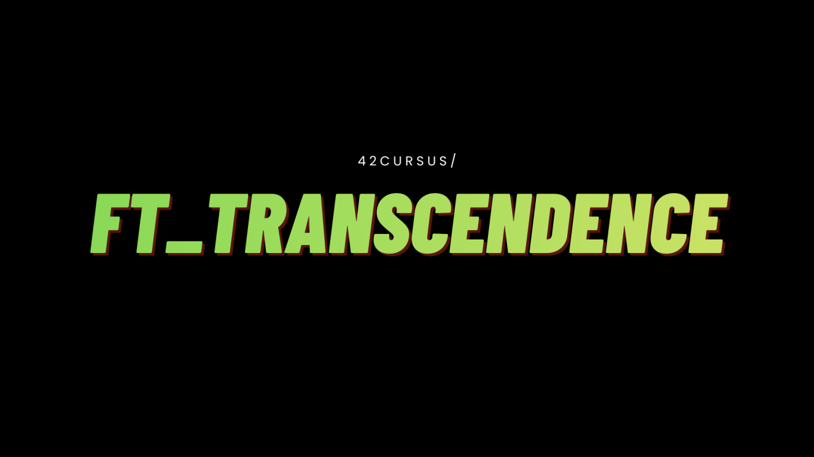

<div id="top">

<!-- HEADER STYLE: CLASSIC -->
<div align="center">



<em></em>

<!-- BADGES -->
<!-- local repository, no metadata badges. -->

<em>Built with the tools and technologies:</em>


<br>


</div>
<br>

---

## Table of Contents

- [Table of Contents](#table-of-contents)
- [Overview](#overview)
- [Features](#features)
- [Project Structure](#project-structure)
    - [Project Index](#project-index)
- [Getting Started](#getting-started)
    - [Prerequisites](#prerequisites)
    - [Installation](#installation)
    - [Usage](#usage)
    - [Testing](#testing)
- [Roadmap](#roadmap)
- [Contributing](#contributing)
- [License](#license)
- [Acknowledgments](#acknowledgments)

---

## Overview

**ft_transcendence** a comprehensive, real-time web application that brings the classic Pong experience into the modern era. Designed with a focus on concurrency, scalability, and user experience, this platform is more than just a game; it's a full-featured social ecosystem.

The project integrates real-time WebSockets for instantaneous gameplay and chat, secure authentication with 2FA, and a comprehensive monitoring stack to ensure 99.9% uptime and performance reliability.

---

## Features

**🎮 The Arena (Core Gameplay)**
- **Real-time Multiplayer:** Low-latency Pong matches powered by WebSockets.
- **Dual Mode Support:**
    - **Local Play:** Battle friends on the same machine.
    - **Remote Play:** Matchmaking system for global challenges.
- **AI Contender:** An intelligent bot system for solo practice and skill-building.
- **Live Game Synchronization:** Seamless state management across all connected clients.

**💬 Social Hub (Chat & Community)**
- **Dynamic Chat Rooms:** Create, join, and manage public or password-protected channels.
- **Direct Messaging (DMs):** Private, secure communication between users.
- **Moderation Tools:** Admin capabilities including kicking, banning, and promoting members.
- **Live Status Tracking:** Real-time "Online/Offline/In-Game" status indicators.
- **Friend System:** Manage relationships, block intruders, and invite friends to matches.

**🔐 Security & Identity**
- **Multi-Strategy Auth:** Support for traditional credentials and OAuth2 (42 & Google).
- **Advanced Protection:**
    - **Two-Factor Authentication (2FA):** Google Authenticator integration for account security.
    - **JWT Security:** Secure token-based sessions with refresh rotation.
- **Profile Customization:** Personalize your presence with avatars and unique handles.


**📊 Engine & Orchestration**
- **Scalar Interactive Docs:** Sleek, modern API documentation accessible at /docs.
- **Observation Stack:**
    - **ELK Stack:** Centralized logging for debugging and audit trails.
    - **Prometheus & Grafana:** Real-time performance metrics and visual dashboards.
- **Database Reliability:** Type-safe interactions using Prisma ORM with PostgreSQL.
- **Dockerized Environment:** Fully containerized services for consistent "one-command" deployment.

---

## Project Structure

<code>❯ *48 directories, 35 files* </code>

```sh
.
├── assets
│   └── cover.png
├── backend
│   ├── Dockerfile
│   ├── ecosystem.config.cjs
│   ├── ecosystem.config.js
│   ├── filebeat.yml
│   ├── nodemon.json
│   ├── package-lock.json
│   ├── package.json
│   ├── postcss.config.js
│   ├── prisma
│   │   └── schema.prisma
│   ├── public
│   │   └── images
│   ├── src
│   │   ├── app.ts
│   │   ├── auth
│   │   ├── controllers
│   │   ├── generated
│   │   ├── hooks
│   │   ├── middleware
│   │   ├── models
│   │   ├── plugins
│   │   ├── routes
│   │   ├── schemas
│   │   ├── server.ts
│   │   ├── services
│   │   ├── tests
│   │   ├── types
│   │   └── utils
│   └── tsconfig.json
├── CONTRIBUTING.md
├── docker-compose.yml
├── frontend
│   ├── dist
│   │   ├── assets
│   │   └── index.html
│   ├── Dockerfile
│   ├── index.html
│   ├── nginx.conf
│   ├── package-lock.json
│   ├── package.json
│   ├── postcss.config.js
│   ├── src
│   │   ├── app.tsx
│   │   ├── assets
│   │   ├── components
│   │   ├── config
│   │   ├── context
│   │   ├── global
│   │   ├── lib
│   │   ├── main.tsx
│   │   ├── router.tsx
│   │   ├── screens
│   │   ├── services
│   │   ├── styles
│   │   ├── svg.d.ts
│   │   └── types
│   ├── tailwind.config.js
│   ├── tsconfig.json
│   └── vite.config.ts
├── LICENSE
├── monitoring
│   ├── ELK-Stack
│   │   ├── docker-compose.yml
│   │   ├── filebeat
│   │   ├── logstash
│   │   ├── nginx
│   │   ├── setupDashboards
│   │   ├── setupDataCycleLife
│   │   ├── setupPassowrds
│   │   └── setupSSL
│   └── PrometheusGrafana
│       ├── alertmanager
│       ├── docker-compose.yaml
│       ├── grafana
│       ├── LICENSE
│       ├── Makefile
│       ├── prometheus
│       └── service-x
└── README.md
```

---

## Getting Started

### Prerequisites

This project requires the following dependencies:

- **Programming Language:** JavaScript
- **Package Manager:** Npm, Yarn
- **Container Runtime:** Docker

### Installation

Build  from the source and intsall dependencies:

1. **Clone the repository:**

    ```sh
    git clone ../
    ```

2. **Navigate to the project directory:**

    ```sh
    cd 
    ```

3. **Install the dependencies:**

    <br/>

    [](https://www.docker.com/)

    **Using [docker](https://www.docker.com/):**

    ```sh
    docker build -t my-app .
    ```

    [](https://www.npmjs.com/)
	**Using [npm](https://www.npmjs.com/):**

	```sh
	npm install
	```

    [](https://yarnpkg.com/)
	**Using [yarn](https://yarnpkg.com/):**

	```sh
	yarn install
	```

    [](https://bun.sh/)
    **Using [bun](https://bun.sh/):**

    ```sh
    bun install
    ```

### Usage

Run the project with:

**Using [docker](https://www.docker.com/):**
```sh
docker run -it {image_name}
```
**Using [npm](https://www.npmjs.com/):**
```sh
npm start
```
**Using [yarn](https://yarnpkg.com/):**
```sh
yarn start
```

---

## Contributing

- **💬 [Join the Discussions](https://LOCAL///discussions)**: Share your insights, provide feedback, or ask questions.
- **🐛 [Report Issues](https://LOCAL///issues)**: Submit bugs found or log feature requests for the `` project.
- **💡 [Submit Pull Requests](https://LOCAL///blob/main/CONTRIBUTING.md)**: Review open PRs, and submit your own PRs.

<details closed>
<summary>Contributing Guidelines</summary>

1. **Fork the Repository**: Start by forking the project repository to your LOCAL account.
2. **Clone Locally**: Clone the forked repository to your local machine using a git client.
   ```sh
   git clone .
   ```
3. **Create a New Branch**: Always work on a new branch, giving it a descriptive name.
   ```sh
   git checkout -b new-feature-x
   ```
4. **Make Your Changes**: Develop and test your changes locally.
5. **Commit Your Changes**: Commit with a clear message describing your updates.
   ```sh
   git commit -m 'Implemented new feature x.'
   ```
6. **Push to LOCAL**: Push the changes to your forked repository.
   ```sh
   git push origin new-feature-x
   ```
7. **Submit a Pull Request**: Create a PR against the original project repository. Clearly describe the changes and their motivations.
8. **Review**: Once your PR is reviewed and approved, it will be merged into the main branch. Congratulations on your contribution!
</details>

---

## License

 is protected under the [LICENSE](https://choosealicense.com/licenses) License. For more details, refer to the [LICENSE](https://choosealicense.com/licenses/) file.

---

## Acknowledgments

- Credit `contributors`, `inspiration`, `references`, etc.

<div align="right">

[![][back-to-top]](#top)

</div>


[back-to-top]: https://img.shields.io/badge/-BACK_TO_TOP-151515?style=flat-square


---
