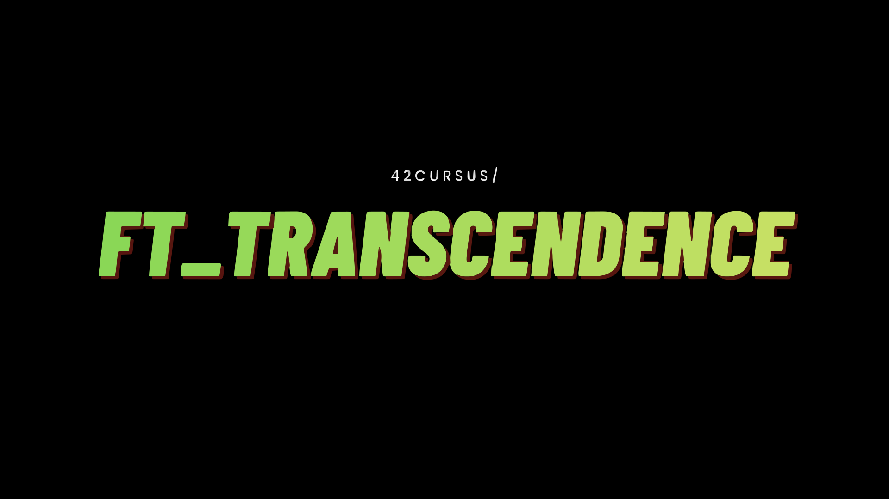

<div id="top">

<!-- BADGES -->
<p align="center">
  
  
  
  
</p>

<br/>

<em></em>

<!-- HEADER STYLE: CLASSIC -->
<div align="center">



<em></em>

<br/>

<em>Built with the tools and technologies:</em>


<br>


</div>
<br>

---

## Table of Contents

- [Table of Contents](#table-of-contents)
- [Overview](#overview)
- [Features](#features)
- [Project Structure](#project-structure)
- [Getting Started](#getting-started)
    - [Prerequisites](#prerequisites)
    - [Installation](#installation)
    - [Usage](#usage)
- [Contributing](#contributing)
- [License](#license)

---

## Overview

**ft_transcendence** is a **full-stack web application** built as part of the 42 curriculum.
The project focuses on designing, developing, and deploying a **real-time multiplayer Pong platform** with modern web technologies.

It emphasizes:

* **Real-time communication**
* **User authentication & security**
* **Scalable backend architecture**
* **Clean frontend UX**
* **Production-ready DevOps practices**

Users can authenticate, play Pong matches in real time, track their game history, and interact with other players in a secure environment.

##### Project Goals

* Apply **full-stack engineering principles**
* Handle **real-time systems** correctly
* Build a **maintainable and scalable architecture**
* Follow **security best practices**
* Deliver a **clean, production-grade project**

##### Features

* Real-time Pong gameplay
* User authentication & authorization
* Matchmaking and game sessions
* User profiles and statistics
* Secure API & protected routes
* Dockerized development & deployment

---

## Project Structure

```sh
└── /
    ├── LICENSE
    ├── Makefile
    ├── README.md
    ├── backend
    │   ├── .dockerignore
    │   ├── .env.example
    │   ├── .gitignore
    │   ├── Dockerfile
    │   ├── LICENSE
    │   ├── Makefile
    │   ├── README.md
    │   ├── endpoints
    │   ├── filebeat.yml
    │   ├── monitoring
    │   ├── nodemon.json
    │   ├── package-lock.json
    │   ├── package.json
    │   ├── postcss.config.js
    │   ├── prisma
    │   ├── public
    │   ├── src
    │   └── tsconfig.json
    ├── docker-compose.yml
    ├── frontend
    │   ├── .dockerignore
    │   ├── .gitignore
    │   ├── Dockerfile
    │   ├── README.md
    │   ├── index.html
    │   ├── nginx.conf
    │   ├── package-lock.json
    │   ├── package.json
    │   ├── postcss.config.js
    │   ├── src
    │   ├── tailwind.config.js
    │   ├── tsconfig.json
    │   └── vite.config.ts
    └── package-lock.json
```

---

## Getting Started

### Prerequisites

This project requires the following dependencies:

- **Programming Language:** TypeScript
- **Package Manager:** Npm
- **Container Runtime:** Docker

### Installation

Build  from the source and intsall dependencies:

1. **Clone the repository:**

    ```sh
    ❯ git clone ../
    ```

2. **Navigate to the project directory:**

    ```sh
    ❯ cd 
    ```

3. **Install the dependencies:**
<br/>

[![docker][docker-shield]][docker-link]

[docker-shield]: https://img.shields.io/badge/Docker-2CA5E0.svg?style=flat&logo=docker&logoColor=white
[docker-link]: https://www.docker.com/

```sh
❯ docker build -t / .
```

[![npm][npm-shield]][npm-link]

[npm-shield]: https://img.shields.io/badge/npm-CB3837.svg?style=flat&logo=npm&logoColor=white
[npm-link]: https://www.npmjs.com/

```sh
❯ npm install
```

### Usage

Run the project with:

**Using [docker](https://www.docker.com/):**
```sh
docker run -it {image_name}
```
**Using [npm](https://www.npmjs.com/):**
```sh
npm start
```

---

## Contributing

- **💬 [Join the Discussions](https://LOCAL///discussions)**: Share your insights, provide feedback, or ask questions.
- **🐛 [Report Issues](https://LOCAL///issues)**: Submit bugs found or log feature requests for the `` project.
- **💡 [Submit Pull Requests](https://LOCAL///blob/main/CONTRIBUTING.md)**: Review open PRs, and submit your own PRs.

<details closed>
<summary>Contributing Guidelines</summary>

1. **Fork the Repository**: Start by forking the project repository to your LOCAL account.
2. **Clone Locally**: Clone the forked repository to your local machine using a git client.
   ```sh
   git clone .
   ```
3. **Create a New Branch**: Always work on a new branch, giving it a descriptive name.
   ```sh
   git checkout -b new-feature-x
   ```
4. **Make Your Changes**: Develop and test your changes locally.
5. **Commit Your Changes**: Commit with a clear message describing your updates.
   ```sh
   git commit -m 'Implemented new feature x.'
   ```
6. **Push to LOCAL**: Push the changes to your forked repository.
   ```sh
   git push origin new-feature-x
   ```
7. **Submit a Pull Request**: Create a PR against the original project repository. Clearly describe the changes and their motivations.
8. **Review**: Once your PR is reviewed and approved, it will be merged into the main branch. Congratulations on your contribution!
</details>

<details>
<summary>Contributor Graph</summary>
<br>
<p align="left">
<a href="https://github.com/Aziz018/ft_transcendence/graphs/contributors">
  
</a>
</p>
</details>

---

## License

 is protected under the [MIT](https://choosealicense.com/licenses/mit/) License. For more details, refer to the [LICENSE](LICENSE) file.

<div align="right">

[![][back-to-top]](#top)

</div>

[back-to-top]: https://img.shields.io/badge/-BACK_TO_TOP-151515?style=flat-square
